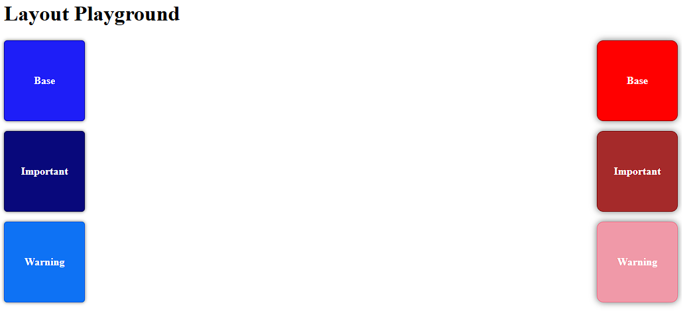
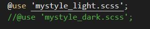

# Temas distintos

Crear dos temas distintos afectando a:

- Color
- Fuente
- Border Radius
- Shadow Box

## Indicaciones

- **mystyle.scss:** Estructura css general.

- **variables.scss:** Variables definidas.

- **mystyle_light.scss / mystyle_dark.scss:** Estilos aplicados a cada tema.

Para poder comprobar cada estilo, pueden cambiar el _@use_ declarado sobre el archivo principal _mystyle.scss_.

