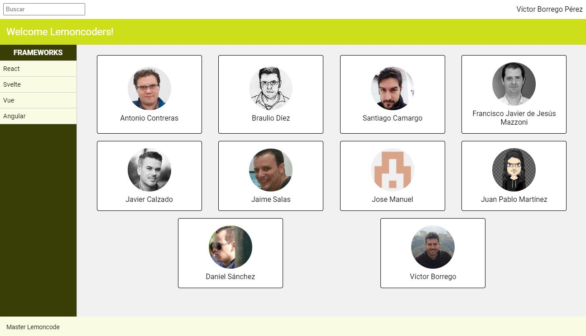

# Modulo 1 - Layout - Laboratorio Extra

Este laboratorio es EXTRA, y por tanto opcional, pero nuestro consejo es que los cubras todos.

Aquí tienes el enunciado:

Aquí tienes a modo de arranque el HTML base. Tiene todo lo necesario, pero puedes modificarlo según tus necesidades:

[index.html](../Doc/index.html)
