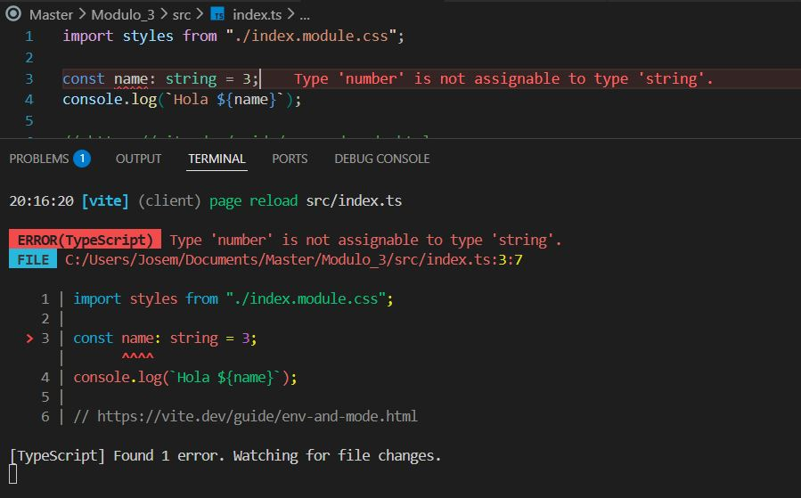
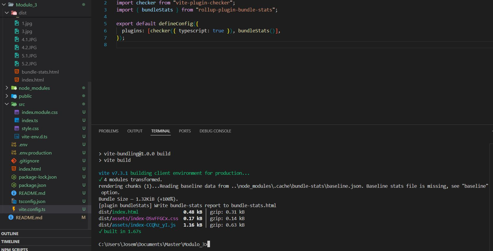
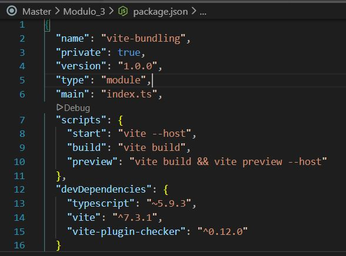
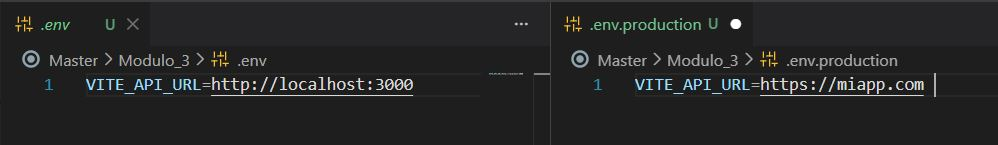
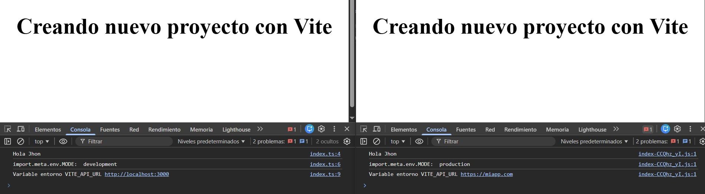
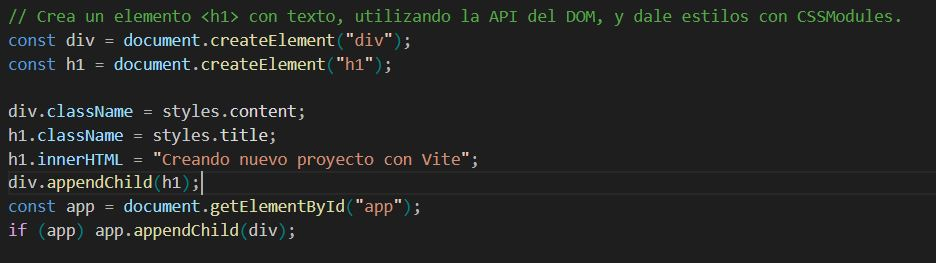
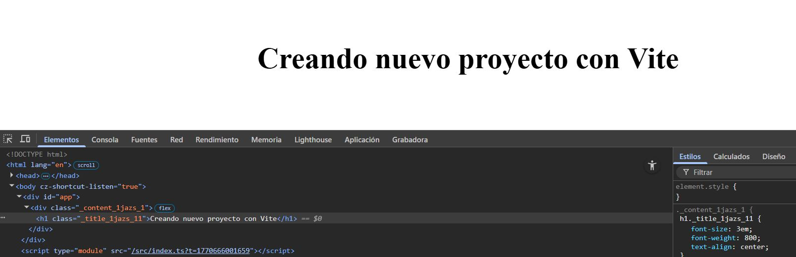

# Laboratorio de bundling

1. Esté configurado con TypeScript y que permita detectar errores de tipos en la terminal si los hubiera.

   

2. Se pueda ver el tamaño del bundle.

   

3. Tenga los scripts básicos de desarrollo local:

   

4. Crea un setup de modo que las variables puedan tener un valor para desarrollo y otro distinto para producción.

   

   Se muestran dos navegadores, uno con servidor en desarrollo y otro en producción.

   

5. Crea un elemento \<h1> con texto, utilizando la API del DOM, y dale estilos con CSSModules.

   
   

## Opcional

Añade la configuración necesaria para que al hacer la build también genere los ficheros de forma comprimida (GZIP y BROTLI), por lo que al hacer la build deberán existir los ficheros dist/index-<hash>.js.gz y un dist/index-<hash>.js.br.

_[Paquete NPM (vite-plugin-compression2)](https://www.npmjs.com/package/vite-plugin-compression2)_
