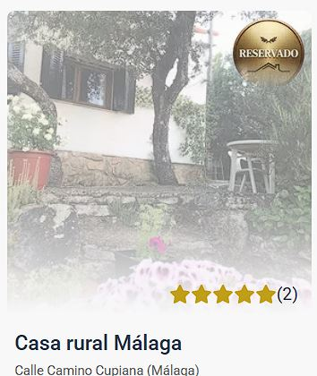

# Casas rurales - Next.js

## Descripción del proyecto

Aplicación desarrollada como parte del Máster Front End XIX - Módulo 5 - MetaFrameworks de LemonCode.

Uso de metaframeworks modernos y aplicar buenas prácticas de rendering, navegación, búsqueda y optimización de rendimiento en una web de casas rurales.

La propuesta está enfocada en ofrecer una experiencia de usuario fluida, con dos pantallas principales: un listado de casas rurales y una vista de detalle para cada alojamiento.

## Instalación y ejecución

Variables de entorno necesarias:

```js
BASE_API_URL=http://localhost:3001/api
BASE_PICTURES_URL=http://localhost:3001
IMAGES_DOMAIN=localhost
```

1. Instalación de dependencias:

   ```bash
   # Instalar dependencias del FrontEnd (raíz)
   npm install
   ```

   ```bash
   # Instalar dependencias de la API local
   cd api-server
   npm install
   ```

2. Iniciar api server

   ```bash
   cd /api-server
   npm start
   ```

3. Iniciar la aplicación en modo desarrollo:

   ```bash
   # confirmar que se encuentre en la raíz del proyecto
   npm run dev
   ```

4. Acceder a la aplicación en el navegador:
   ```bash
   http://localhost:3000
   ```

## Desafíos implementados

### 1. Implementación con un metaframework: Next.JS

Desarrollado con Next.js, framework de React que permite trabajar con renderizado del lado del servidor y optimización automática de la aplicación.

### 2. Pantalla de listado de casas rurales

Implementada una pantalla inicial en la que se muestra un listado de las casas rurales disponibles. Cada tarjeta incluye información básica como nombre, ubicación, precio, una imagen destacada y una insignia si esa casa estuviera ya reservada.

### 3. Pantalla de detalle de una casa rural

Cada casa del listado puede navegarse a una vista de detalle, donde se muestra información más completa del alojamiento, como descripción, comodidades, reseñas y precio por noche.

### 4. Rendering adecuado según la página

- La página de listado de casas: ISR (Incremental Static Regeneration).

  Revalidación establecida en 10 minutos.

  Realiza una precarga al hacer la build de las tres primeras casas en este caso, que también podrían ser las más visitadas o mejor posicionadas.

  ```tsx
  export async function generateStaticParams() {
    return [{ id: "1" }, { id: "2" }, { id: "3" }];
  }
  ```

  ISR pre-renderiza las páginas en tiempo de build para que carguen instantáneamente y actualiza su contenido en segundo plano en servidor si este cambia.

  ```tsx
  export const getHouseList = async (): Promise<API.House[]> => {
    const url = `${ENV.BASE_API_URL}/houses`;
    return await fetch(url, { next: { revalidate: 600 } }).then((response) =>
      response.json(),
    );
  };
  ```

- La página de detalle se prepara con generación estática para las rutas principales y renderizado incremental, lo que mejora la velocidad de carga y la escalabilidad.

  ```tsx
  export const getHouseDetailsById = async (id: string): Promise<House> => {
    const url = `${ENV.BASE_API_URL}/houses/${id}`;
    const result = await fetch(url, { next: { revalidate: 300 } });
    return result.json();
  };
  ```

### 5. Búsqueda en el listado

Búsqueda que permite filtrar casas por nombre o ubicación, mejorando la navegación y la experiencia del usuario.

```tsx
const { search, setSearch, filterDebounce } = useDebouncedSearch();
const filteredHouses = useMemo(
  () =>
    houses.filter(
      (house) =>
        house.name.toLowerCase().includes(filterDebounce) ||
        house.city.toLowerCase().includes(filterDebounce),
    ),
  [houses, filterDebounce],
);
```

### 6. Botón para reservar una casa rural

En la vista de detalle se incluye un botón para reservar una casa rural. La interacción está gestionada de forma sencilla mediante contexto y permite marcar visualmente si una propiedad ya ha sido reservada.




### 7. Optimización de imágenes

Las imágenes del proyecto se gestionan utilizando Next Image, que optimiza el rendimiento de la aplicación y la experiencia en dispositivos móviles.

### 8. Testing (Vitest)

Test implementados para los métodos mapped de ambas páginas (listado y detalle).

## Tecnologías utilizadas

- Next.js
- React
- TypeScript
- Sass
- Next Image
- Vitest

## Funcionalidades principales

- Página principal para la visualización del listado de casas rurales
- Navegación entre listado y detalle
- Búsqueda por nombre o ubicación (ciudad)
- Reserva de una casa rural
- Optimización de imágenes con Next Image
- Renderizado para mejorar el rendimiento y la experiencia del usuario (ISR)
