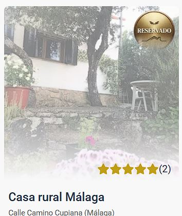

# Casas rurales - TanStack Start

## Descripción del proyecto

Aplicación desarrollada como parte del Máster Front End XIX - Módulo 5 - MetaFrameworks de LemonCode.

Uso de metaframeworks modernos y aplicar buenas prácticas de rendering, navegación, búsqueda y optimización de rendimiento en una web de casas rurales.

La propuesta está enfocada en ofrecer una experiencia de usuario fluida, con dos pantallas principales: un listado de casas rurales y una vista de detalle para cada alojamiento.

## Instalación y ejecución

Variables de entorno necesarias:

```js
BASE_API_URL=http://localhost:3001/api
VITE_BASE_PICTURES_URL=http://localhost:3001
```

1. Instalación de dependencias:

   ```bash
   # Instalar dependencias del FrontEnd (raíz)
   npm install
   ```

   ```bash
   # Instalar dependencias de la API local
   cd api-server
   npm install
   ```

2. Iniciar api server

   ```bash
   cd /api-server
   npm start
   ```

3. Iniciar la aplicación en modo desarrollo:

   ```bash
   # confirmar que se encuentre en la raíz del proyecto
   npm run dev
   ```

4. Acceder a la aplicación en el navegador:
   ```bash
   http://localhost:5173
   ```

## DESAFÍOS IMPLEMENTADOS

### 1. Implementación con un metaframework: TanStack Start

Desarrollado con TanStack Start, framework full-stack que permite trabajar con renderizado del lado del servidor y optimización automática de la aplicación utilizando librerías con React, Svelte o Vue.

### 2. Pantalla de listado de casas rurales

Implementada una pantalla inicial en la que se muestra un listado de las casas rurales disponibles. Cada tarjeta incluye información básica como nombre, ubicación, precio, una imagen destacada y una insignia si esa casa estuviera ya reservada.

### 3. Pantalla de detalle de una casa rural

Cada casa del listado puede navegarse a una vista de detalle, donde se muestra información más completa del alojamiento, como descripción, comodidades, reseñas y precio por noche.

### 4. Rendering aplicado

#### **PÁGINA PRINCIPAL**

ISR (Incremental Static Regeneration). Revalidación establecida en 5 minutos.

`/src/routes/index.tsx`

```ts
export const Route = createFileRoute("/")({
  loader: async () => API.getHouseList(),
  headers: () => ({
    "Cache-Control": "public, max-age=300, stale-while-revalidate=600",
  }),
  staleTime: 60_000,
  component: Home,
});
```

`/src/pods/house-list/api/house-list.api.ts`

```ts
export const getHouseList = createServerFn().handler(async () => {
  const baseUrl = getPrivateEnv().BASE_API_URL;
  const response = await fetch(`${baseUrl}/houses`, {});

  if (!response.ok) {
    throw new Error(`Error ${response.status} al cargar casas`);
  }

  return response.json();
});
```

**Caché de red a nivel HTTP**

- **max-age:** Tiempo en segundos que considera como actualizados los datos antes de volver a hacer nuevo fetch

- **stale-while-revalidate:** Tiempo en segundos que sigue sirviendo los datos después de superar `max-age` mientras los actualiza de nuevo.

**Caché de aplicación**

- **staleTime:** Tiempo en milisegundos. Caché de aplicación en navegación interna sin recarga de página completa.

Precarga de las imágenes de los tres primeros resultados del listado con prioridad alta para que aparezcan lo antes posible; el resto con prioridad baja no bloquear el renderizado inicial.

`/src/pods/house-list/components/card/card.tsx`

```ts
loading={index < 3 ? "eager" : "lazy"}
```

#### **PÁGINA DE DETALLE**

Aplicado ISR con revalidación establecida en 3 minutos.

`/src/routes/detalle/$id.tsx`

```ts
export const Route = createFileRoute("/detalle/$id")({
  loader: async ({ params }) =>
    await API.getHouseDetailsById({ data: { id: params.id } }),
  headers: () => ({
    "Cache-Control": "public, max-age=180, stale-while-revalidate=360",
  }),
  head: ({ loaderData }) => ({
    meta: [
      {
        title: loaderData
          ? `${loaderData.name} | ${SEO.sitename}`
          : SEO.sitename,
      },
      {
        name: "description",
        content: loaderData ? loaderData.description : SEO.description,
      },
    ],
  }),
  staleTime: 60_000,
  component: RouteComponent,
});
```

`/src/pods/house-details/api/house-details.api.ts`

```ts
export const getHouseDetailsById = createServerFn()
  .validator((data: { id: string }) => data)
  .handler(async ({ data }) => {
    const baseUrl = `${getPrivateEnv().BASE_API_URL}`;
    return await fetch(`${baseUrl}/houses/${data.id}`)
      .then((result) => result.json())
      .then(mapHouseDetailToVm);
  });
```

### 5. Búsqueda en el listado

Búsqueda que permite filtrar casas por nombre o ubicación, mejorando la navegación y la experiencia del usuario.

`/src/app/pods/house-list/house-list.tsx`

```ts
const { search, setSearch, filterDebounce } = useDebouncedSearch();
const filteredHouses = React.useMemo(
  () =>
    houses.filter(
      (house) =>
        house.name.toLowerCase().includes(filterDebounce) ||
        house.city.toLowerCase().includes(filterDebounce),
    ),
  [houses, filterDebounce],
);
```

Aplica retraso de búsqueda utilizando el hook useDebounceSearch que aplica debounce.

```ts
import { useDebounce } from "use-debounce";

export const useDebouncedSearch = () => {
  const [search, setSearch] = React.useState<string>("");
  const [filterDebounce] = useDebounce(search, 500);

  return { search, setSearch, filterDebounce };
};
```

### 6. Botón para reservar una casa rural

En la vista de detalle se incluye un botón para reservar una casa rural. La interacción está gestionada de forma sencilla mediante contexto y permite marcar visualmente si una propiedad ya ha sido reservada.




### 7. Optimización de imágenes

Imágenes gestionadas utilizando la herramienta [Unpic](https://unpic.pics/) que optimiza el rendimiento de la aplicación y la experiencia en dispositivos móviles.

### 8. Testing (Vitest)

Test implementados para los métodos mapped de ambas páginas (listado y detalle).

## Tecnologías utilizadas

- TansTack Start
- React
- TypeScript
- Sass
- Unpic (Images optimization)
- Vitest

## Funcionalidades principales

- Página principal para la visualización del listado de casas rurales
- Navegación entre listado y detalle
- Búsqueda por nombre o ubicación (ciudad)
- Reserva de una casa rural
- Optimización de imágenes con Unpic
- Renderizado para mejorar el rendimiento y la experiencia del usuario (ISR)
